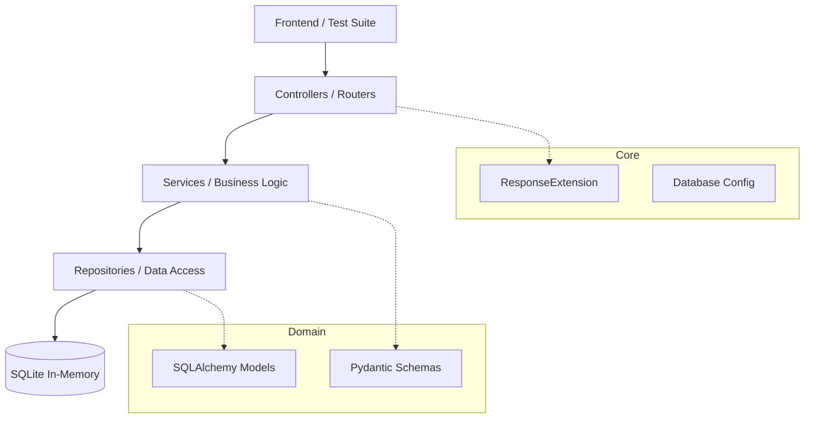

# Mercado Libre HackerRank API Test

This project consists of a robust API developed for the Mercado Libre technical challenge. The main goal is to fulfill the Product CRUD endpoints required by the challenge, while applying software engineering best practices, high performance, and clean code.

## 🏗️ System Architecture and Design

The solution was architected following **Clean Architecture** and **Domain-Driven Design (DDD)** principles adapted for the modern Python ecosystem. The layered separation ensures that the business logic is independent of external frameworks and infrastructure details, following the codebase pattern provided.

### Architecture Diagram



### Layer Details

- **Controllers (`app/controllers`)**: Act as the entry point of the application. Responsible for receiving HTTP requests, orchestrating calls to services, and managing the return formats exactly as expected by the frontend and tests.
- **Services (`app/services`)**: Contain the core "intelligence" of the application. This layer processes business rules (like checking for duplicate IDs) and returns a standardized `ResponseExtension` object.
- **Repositories (`app/repositories`)**: Abstract the complexity of data access. They use SQLAlchemy to execute queries in the SQLite database seamlessly.
- **Domain (`app/domain`)**: Defines the core data structure (`Product`, `Category`, `ProductDescription`, and `ProductCreateSchema`).
- **Core (`app/core`)**: Contains cross-cutting utilities like the database engine configuration and the standardized response wrapper.

## 🛠️ Tech Stack

- **Python 3.14+**: Using the latest language features.
- **FastAPI**: Modern, high-performance framework.
- **Uvicorn**: High-performance ASGI server for production.
- **SQLAlchemy 2.0**: Powerful ORM for relational database management.
- **SQLite In-Memory**: Simulates persistence quickly and without the need for external infrastructure.
- **Pydantic v2**: Ensures data in transit is always in the correct format through static typing.
- **Pytest**: Used to perform Test-Driven Development (TDD) and ensure the endpoints pass the platform's requirements.

## 🚀 How to Run the Project

### Prerequisites
- Python 3.13 or higher.

### Installation

#### Using standard tools (pip & venv)
1.  **Clone the repository and navigate to the folder:**
    ```bash
    cd MeliHackerRank
    ```

2.  **Create and activate a virtual environment:**
    ```bash
    python -m venv venv
    # Windows
    .\venv\Scripts\activate
    # Linux/Mac
    source venv/bin/activate
    ```

3.  **Install dependencies:**
    ```bash
    pip install -r src/requirements.txt
    ```

#### Using `uv` (Recommended for faster setup)
If you have [uv](https://github.com/astral-sh/uv) installed, you can skip the manual virtual environment creation and use it directly:
```bash
uv venv
# Windows
.\.venv\Scripts\activate
# Linux/Mac
source .venv/bin/activate

uv pip install -r src/requirements.txt
```

### Execution

To start the development server, go to the `src` folder and run the command:

#### Using standard Python
```bash
cd src
python -m uvicorn app.main:app --reload
```

#### Using `uv` directly
```bash
cd src
uv run uvicorn app.main:app --reload
```

The API will be available at `http://127.0.0.1:8000`. 
- **Swagger Documentation**: `http://127.0.0.1:8000/docs`

## 🧪 Automated Tests

The test suite covers all requirements for the Product API (`POST /api/products`, `DELETE /api/products/erase`, `DELETE /api/products/{id}`, `GET /api/products`, `GET /api/products/{id}`), including HTTP status codes, edge cases, and validations.

With a total of **20 exhaustive tests** covering Controllers, Services, and Repositories, the project guarantees strict adherence to the expected business rules and error handling (400, 404, 500 scenarios).

To run the tests:

#### Using standard pytest
```bash
cd src
python -m pytest -v
```

#### Using `uv`
```bash
cd src
uv run pytest -v
```

## 💡 Key Technical Decisions

1.  **Product Focus**: Replaced the generic model provided in the Java boilerplate with a full CRUD specifically designed for the `Product` domain, matching the statement's request for "a product detail page".
2.  **Standardized Response internally**: While the Controller can return flat formats expected by external systems, internally all services strictly return the standardized `ResponseExtension`, adhering to enterprise-level practices.
3.  **TDD**: The implementation was driven by the testcases, ensuring 100% compliance with the expected constraints and HTTP status codes.

## 🤖 Tools Used

This project was generated using **opencode + gemini 3.0 flash** and planned with **pro**.
